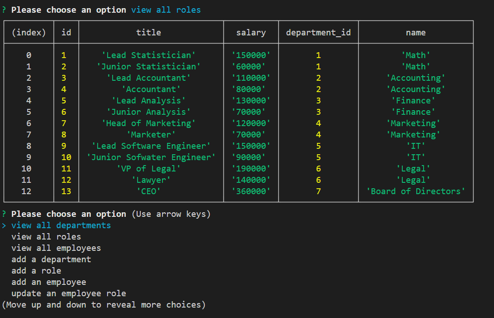
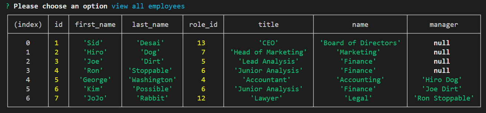
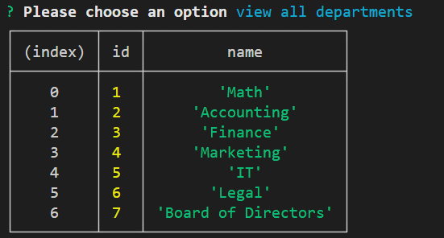
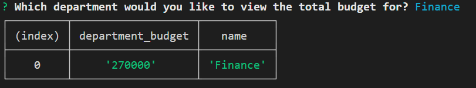

# Employee-Tracker
### Siddharth Desai

## Description
The purpose of this project was to create a command-line application to manage a company's database. The database consist of three tables role, employee and department (shown below). The user will be prompted with a series of choices (shown below) and dpending on their selection they will be able to view/write/delete to the database tables based one their selection. All the results will diplay on the users console. 

```
choices: ["view all departments", "view all roles", "view all employees", "add a department", "add a role", "add an employee", "update an employee role", "delete an employee", "delete a department",  "delete a role", "view a deparment budgetment"]
```


## User Story

```md
AS A business owner
I WANT to be able to view and manage the departments, roles, and employees in my company
SO THAT I can organize and plan my business
```

## Acceptance Criteria

```md
GIVEN a command-line application that accepts user input
WHEN I start the application
THEN I am presented with the following options: view all departments, view all roles, view all employees, add a department, add a role, add an employee, and update an employee role
WHEN I choose to view all departments
THEN I am presented with a formatted table showing department names and department ids
WHEN I choose to view all roles
THEN I am presented with the job title, role id, the department that role belongs to, and the salary for that role
WHEN I choose to view all employees
THEN I am presented with a formatted table showing employee data, including employee ids, first names, last names, job titles, departments, salaries, and managers that the employees report to
WHEN I choose to add a department
THEN I am prompted to enter the name of the department and that department is added to the database
WHEN I choose to add a role
THEN I am prompted to enter the name, salary, and department for the role and that role is added to the database
WHEN I choose to add an employee
THEN I am prompted to enter the employee’s first name, last name, role, and manager, and that employee is added to the database
WHEN I choose to update an employee role
THEN I am prompted to select an employee to update and their new role and this information is updated in the database 
```
[](https://opensource.org/licenses/BSD-2-Clause)

## Table of Contents
1. [ Description. ](#description)
2. [ Installation. ](#installation)
3. [ Usage. ](#usage)
4. [ License. ](#license)
5. [ Tests. ](#tests)
6. [ Screenshots. ](#screenshots)
7. [ Questions. ](#questions)
8. [ Links. ](#links)
9. [ Resources. ](#resources)

## Installation
* Clone the repository using:
```
git clone git@github.com:SHD327/Employee-Tracker.git
```
* Ensure you are in the current working directory
* Ensure all dependencies are installed as shown below installation instructions are below:
```
{
  "dependencies": {
    "console.table": "^0.10.0",
    "dotenv": "^10.0.0",
    "inquirer": "^8.2.0",
    "mysql2": "^2.3.3-rc.0"
  }
}

```
Run the below commands to install any missing dependencies
```
npm install inquire
````
```
npm install mysql2
```
```
npm install dotenv
```

## Usage
* Ensure all depencies and above steps are fulfilled 
* Navigate to the working directory and open a terminal and run the below command
```
mysql -u root -p
```
* After enter password run the below command to initiliaze the database
```
SOURCE schema.sql || SOURCE seeds.sql
```
* Lastly start the application with the below command:
```
node index.js
```

## License
Free Use

## Tests
N/A

## Screenshots





## Questions?
Want to see more of my work? [Github Link](https://github.com/SHD327)
<br/>
Want to learn more please contact me at shdesai327@gmail.com

## Links

* https://github.com/SHD327/Employee-Tracker

## Resources
* https://www.npmjs.com/package/inquirer
* https://www.mysql.com/
* https://www.npmjs.com/package/dotenv
* https://www.w3schools.com/sql/
